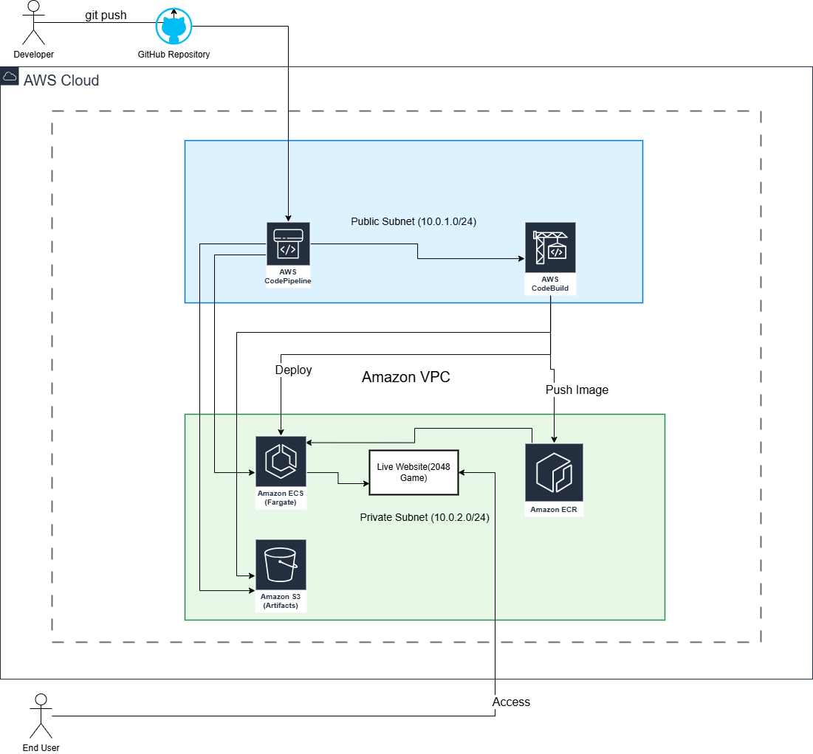
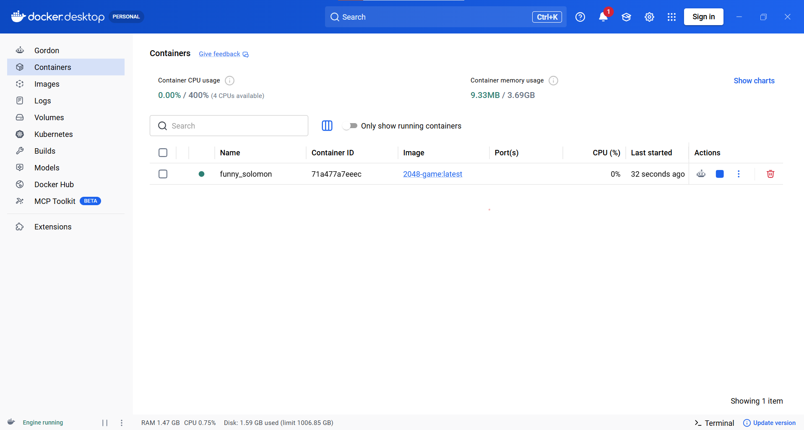
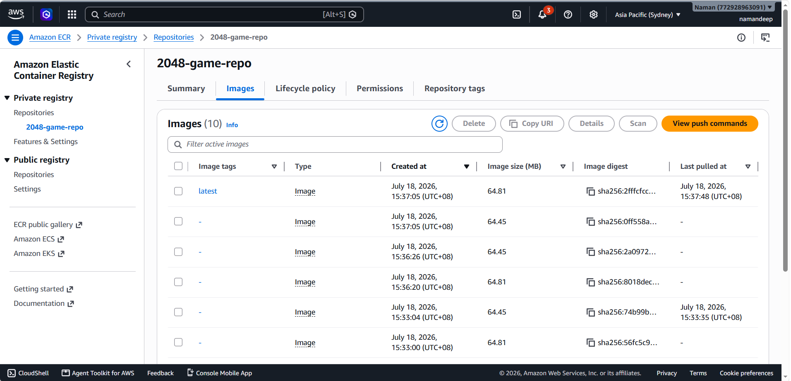
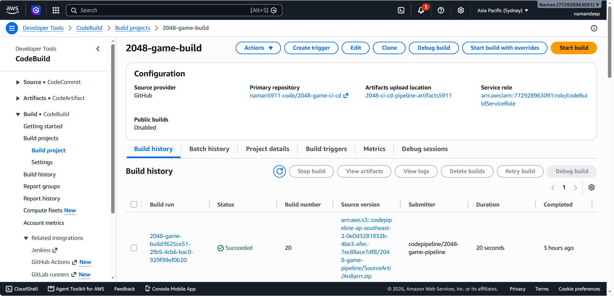
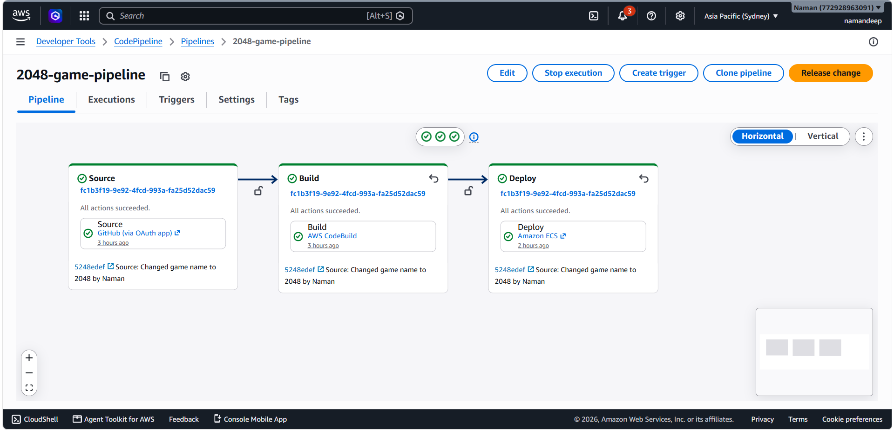
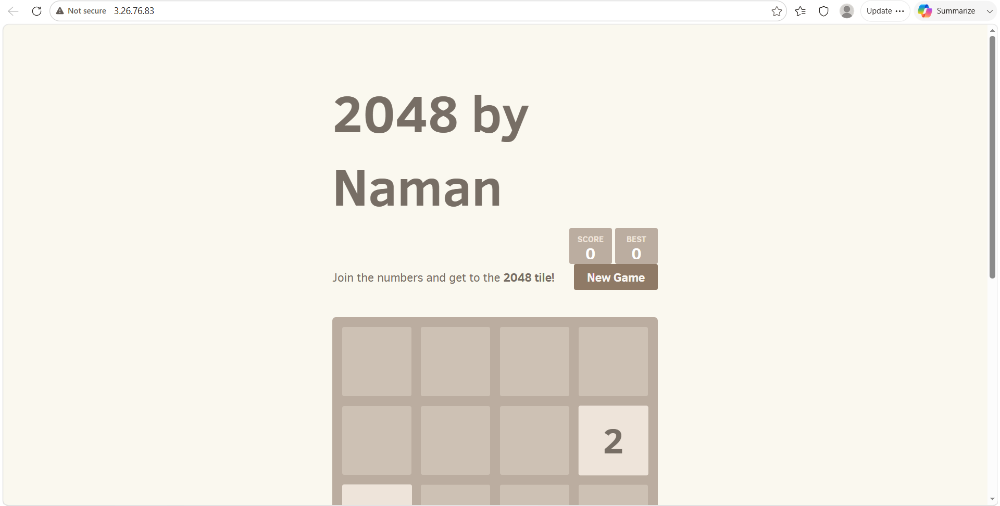

# 🚀 CI/CD Pipeline for 2048 Game on AWS

## 📋 Overview
A fully automated CI/CD pipeline that deploys a Dockerized 2048 game to AWS ECS Fargate. Every code push to GitHub triggers an automatic build and deployment.

## 🛠️ AWS Services Used
- AWS CodePipeline, CodeBuild, ECR, ECS (Fargate), IAM, S3

## 🏗️ System Architecture


## 📸 Project Screenshots

### 1. Local Docker Desktop Validation


### 2. Amazon ECR Artifact Repository


### 3. AWS CodeBuild Success Logs


### 4. AWS CodePipeline Conveyor Belt Complete


### 5. Production Live Website (Hosted on ECS Fargate)


## ✨ Features
- ✅ Auto-deploy on every GitHub push
- ✅ Dockerized app on ECS Fargate
- ✅ Fully automated CI/CD pipeline

## 🔧 How It Works
1. Push code to GitHub → CodePipeline triggers
2. CodeBuild builds Docker image → Pushes to ECR
3. ECS service updates → Live website updates instantly

## 🚀 How to Run Locally
If you have Docker Desktop installed, you can spin up this game locally on your computer:
1. **Build the image:** 
   ```bash
   docker build -t 2048-game .
   ```
2. **Run the container:** 
   ```bash
   docker run -d -p 8080:80 --name local-2048 2048-game
   ```
3. **Verify:** Open your web browser and visit `http://localhost:8080`

## 👨‍💻 Author
**Namandeep Singh** - Computer Science Graduate

[Portfolio](https://naman5911-code.github.io/.github.io/) | [LinkedIn](www.linkedin.com/in/namandeep-singh-31b2412a1)
